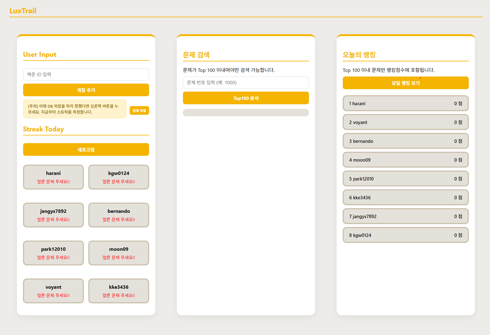

## 💫LuxTrail

Check friends' streaks on Baekjoon  
using Solved.ac API(Unofficial)
<br>
  
Solved의 비공식 API를 이용하여 동작  
Solvedac/Unofficial-documentation: https://solvedac.github.io/unofficial-documentation/#/  
  

<br>
 
---

### 프로젝트 동기

**한 페이지에서 스터디원의 문제풀이 정보를 확인하고 싶다!**

스터디장으로서 알고리즘 스터디를 진행하려다보니  
스터디원들이 오늘 문제를 풀었는지 여부를 매번 직접 묻거나 확인해야하는 작업이 불편하였다.  
또한, 오늘 다 같이 풀기로 한 문제를 풀었는지도 확인하여야했기에 불편함이 두배였다.  

<br>

---

###  페이지 기능 구성

#### 1. 유저 스트릭 정보 확인

* 유저가 **오늘 문제를 풀었는지 여부** 표시
* 푼 문제의 개수를 한 눈에 확인 가능
  
<br>

#### 2. 특정 문제 풀이 여부 확인

* 문제 번호를 입력하면,
* 스터디원이 **그 문제를 풀었는지 여부**를 한 눈에 표시  
  
<br>

#### 3. 당일 유저 랭킹 확인

* 전체 스터디원의 랭킹 제공
* 당일 푼 문제의 티어를 기준으로 점수를 내어 랭킹 생성  
  
<br>

Solved API 비공식 API는 유저의 당일 푼 문제에 대한 정보를 제공하지 않으므로  
Top 100을 넘어가는 문제는 분석이 불가능합니다.

<br>

---

### 설치 및 실행 방법

#### Python 환경 설정

```bash
원하는 폴더로 가기
git clone https://github.com/siris-Kang/Luxtrail.git
cd Luxtrail
python -m venv luxtrail
luxtrail\Scripts\activate  # Linux / macOS: source luxtrail/bin/activate
pip install -r requirements.txt
```

⚠️ python 가상환경 생성은 필수가 아니다.  
VSCode Terminal에서 가상환경을 실행할 경우 **[Error] Activate.ps1 파일을 로드할 수 없습니다**가 날 수 있다.   
이는 PowerShell의 스크립트 실행 정책 때문이며, 다음의 방법으로 PowerShell 실행 정책을 일시적으로 완화시킬 수 있다.  
 ① **관리자 권한**으로 PowerShell을 열고 다음 명령어 실행:  
```bash
Set-ExecutionPolicy -ExecutionPolicy RemoteSigned -Scope Process
Y```
 * RemoteSigned: 로컬에서 만든 스크립트는 실행 가능, 인터넷에서 받은 스크립트는 서명 필요  
 * Scope Process: 현재 PowerShell 세션에서만 유효  

② 가상환경 다시 활성화  
```bash
.\luxtrail\Scripts\Activate.ps1```

③(luxtrail)가 앞에 뜨면 완료  
(luxtrail) PS C:\Users\사용자\Documents\Github\Luxtrail> 
  
<br>

#### 전체 실행 순서

1. Terminal에서 `uvicorn main:app --reload` 실행
2. Webpage에서 로컬 서버 `http://127.0.0.1:8000`에 접근
3. Webpage에서:
   * 유저 계정을 하나씩 입력
   * 새로고침 -> 당일 스트릭 화면 업데이트
   * 문제 번호 입력 -> 문제 체크
   * 당일랭킹보기 -> 랭킹 업데이트

⚠️이 페이지는 log와 DB 기반으로 작동하며,  
자정 이전 DB 미갱신 상황을 위해 **강제 저장** 기능을 제공합니다.  
강제 저장 시점부터 유저의 풀이 기록을 기준으로 스트릭과 랭킹 비교가 시작됩니다.  

<br>

---

### 사용 예시 화면



<br>

---

### 디렉터리 구조

```Luxtrail
├── main.py
├── functions/
│   ├── solved_count.py
│   ├── top100_db.py
│   └── user_handle.py
├── templates
│   └── index.html
├── static/
│   ├── luxtrail_style.css
│   └── luxtrail_script.js
└── README.md
```

